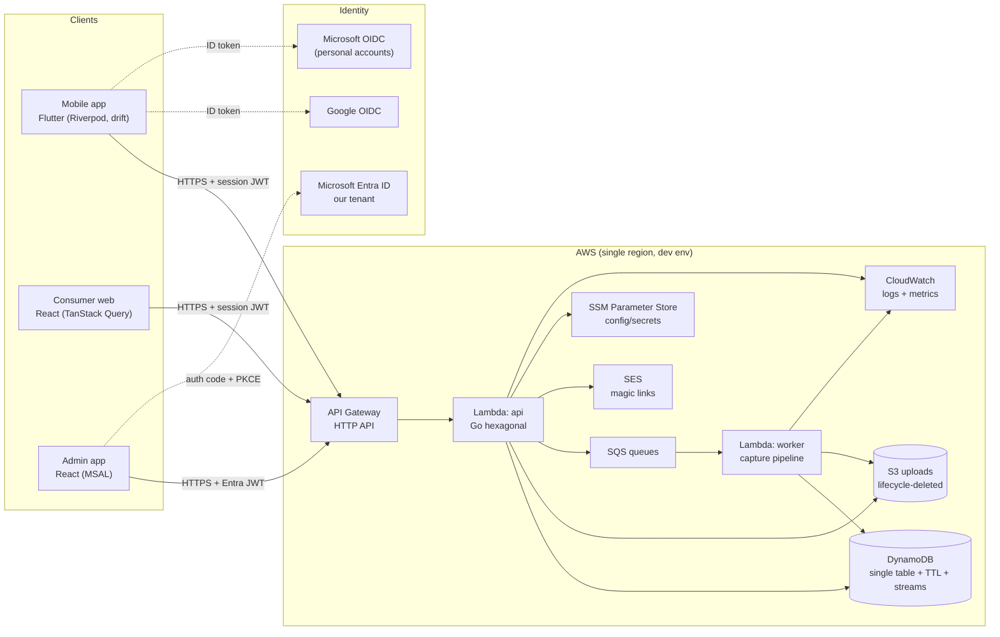

# RFC 001 — Initial Technical Structure

Status: Proposed · July 2026
Relates to: `docs/prd/Saamly_PRD_Parent.md` v0.3 (decisions D1–D9, open questions)
Amended July 2026: repository strategy changed from monorepo to polyrepo (§2, §3.1, §5, §6, §9, §11, §12, §13, §15); local development standardised on floci instead of DynamoDB Local / LocalStack (§9); Nova LLM/vision model routing decided (§7, §14).

This RFC defines the starting technical shape of Saamly: repositories, languages, frameworks, architecture patterns, authentication, hosting, infrastructure as code and code-quality tooling. It covers the P0 dogfood phase and the seams needed for P1; it deliberately defers decisions that depend on evidence we do not yet have (see §14).

## 1. Goals and non-goals

**Goals**

- One deployable system that supports the P0a scope: Flutter app, Go back-end, React admin app, AWS hosting.
- A back-end domain that is free of frameworks, SDKs and infrastructure concerns (hexagonal / ports and adapters), so the strategy's headless capability boundaries (PRD D3) are structural, not aspirational.
- Offline-tolerant mobile client (PRD D8) with local-first lists.
- Auth that is simple now (no permissions) but has a clean seam for roles later.
- Everything provisioned with Terraform from day one; quality gates automated in CI.

**Non-goals (deferred, §14)**

- Vector store / embedding infrastructure for `taxonomy` matching.
- LLM/vision provider selection (a port is defined; the provider is swappable).
- Multi-environment prod hardening, analytics pipelines, push notifications, observability beyond CloudWatch.

## 2. Repository strategy: polyrepo

Five repositories. The current `saamly` repository becomes documentation-only.

| Repo | Contents | Stack |
|---|---|---|
| `saamly` | Documentation only: strategy, PRD, module specs, RFCs (this file) | Markdown |
| `saamly-service` | Back-end API + workers; OpenAPI specs (`api/`); back-end Terraform (`infra/`) | Go, Terraform |
| `saamly-mobile` | Consumer mobile app | Dart / Flutter |
| `saamly-web` | Consumer web app (P0 parity with mobile, for dogfood/testing) | React + TypeScript, Vite |
| `saamly-admin` | Internal admin web app + static-hosting Terraform (`infra/`) | React + TypeScript, Terraform |

Principles:

- **Each deployable owns itself**: its pipeline, its lint/type/test gates, and — where it has infrastructure — its Terraform.
- **The API contract lives with its producer.** `saamly-service/api/` is the source of truth; client repos vendor pinned copies (§6).
- **The docs repo is the source of truth for product decisions** (PRD, module specs, RFCs). Code repos reference it by URL or commit; they never duplicate it.
- **Repo plumbing is intentionally duplicated** (EditorConfig, lefthook, Makefile, CI). Keep copies identical by hand at this scale; extract shared templates only if drift becomes real.

Trade-off accepted: cross-repo coordination — contract sync, version pinning, occasionally three PRs for one contract-affecting change — in exchange for independent release cadence, small blast radius and clean ownership. Mitigations in §6 and §12.

## 3. Back-end: Go, hexagonal architecture

### 3.1 Layout

```
saamly-service/
  cmd/
    api/main.go            # composition root: config → adapters → HTTP server
    worker/main.go         # composition root for SQS consumers (capture pipeline)
  internal/
    domain/                # pure domain, no imports outside stdlib + domain
      household/
      inventory/
      taxonomy/
      recipe/
      plan/
    application/           # use cases: orchestrate domain via ports; tx boundaries
    ports/                 # Go interfaces OWNED by the core (repository, vision,
                           # mailer, tokenverifier, clock, idgen, blobstore, queue)
    adapters/
      httpapi/             # oapi-codegen handlers (chi), middleware, authn
      dynamodb/            # single-table repository implementations
      s3/                  # image blob store, presigned URLs
      sqs/                 # producers/consumers
      ses/                 # magic-link mailer
      oidc/                # Google / Microsoft / Entra token verifiers
      llm/                 # vision + parsing provider client (behind port)
    platform/
      config/              # env parsing, no viper
      logging/             # slog, JSON output
  api/                     # OpenAPI specs: consumer.yaml, admin.yaml (source of truth, §6)
  infra/                   # Terraform: back-end infra + state bootstrap (§11)
  go.mod
```

### 3.2 Rules

- **The domain imports nothing** — no AWS SDK, no HTTP types, no database rows. Entities, value objects, invariants and domain errors only.
- **Ports are defined where they are consumed** (application layer), following Go interface philosophy: small interfaces, accepted not returned.
- **Adapters depend inward.** Wiring happens only in `cmd/` (manual constructor injection — no DI framework at this size).
- **No shared `utils` grab-bag.** Cross-cutting needs (clock, ID generation) are explicit ports so tests stay deterministic.
- **One Lambda binary shape, two entry points.** `api` serves all routes (modular monolith, PRD D3); `worker` consumes queues. Same packages, different bootstrap — a later move to ECS/Fargate is a new `cmd`, not a rewrite.

### 3.3 Key libraries

| Concern | Choice | Notes |
|---|---|---|
| HTTP router | `chi` | stdlib-compatible, composable middleware |
| API codegen | `oapi-codegen` | server interfaces + types generated from `api/` spec; keeps handlers honest |
| OIDC/JWT | `coreos/go-oidc`, `golang-jwt/v5` | provider verification + session tokens |
| AWS SDK | `aws-sdk-go-v2` | adapters only |
| Logging | `log/slog` | JSON handler → CloudWatch |
| Testing | stdlib `testing`, `testify` (assert/require only) | table-driven; race detector in CI |
| Linting | `golangci-lint` | govet, staticcheck, errcheck, gocritic, gofumpt |

## 4. Mobile app: Flutter

### 4.1 Layout (feature-first)

```
saamly-mobile/
  lib/
    main.dart
    src/
      app/                 # SaamlyApp, go_router, theme, global providers
      core/
        config/            # flavours (dev/prod) via --dart-define
        network/           # API client (dio), auth interceptor, token store
        storage/           # drift (SQLite) database + DAOs
        sync/              # outbox processor, background sync
      features/
        auth/
        household/
        inventory/
        capture/
        recipes/
        plan/
        shopping/
        # each feature: domain/ (entities), data/ (repos, mappers, DTOs),
        #               application/ (Riverpod controllers), presentation/ (screens, widgets)
      l10n/                # .arb files; English first (PRD §11.5)
  test/
```

### 4.2 Patterns and libraries

- **State management: Riverpod** (`flutter_riverpod` + `riverpod_generator` codegen + `riverpod_lint`). Compile-safe, testable, no context needed. No Bloc boilerplate, no get_it.
- **Local-first (PRD D8):** `drift` (SQLite) is the on-device source of truth for "what you have" and the shopping list. Mutations write locally first, then to an **outbox table**; a sync processor drains the outbox when connectivity returns. Server responses reconcile into drift. Conflicts resolve last-writer-wins per field-group at P0 (two users, low contention); the outbox guarantees nothing is lost.
- **Navigation:** `go_router`.
- **Models:** `freezed` + `json_serializable`. DTOs live in `data/` and never leak into `domain/` entities.
- **API client:** thin hand-rolled wrapper over `dio` with an auth interceptor (attaches/renews session JWT), written against the vendored spec (`vendor/api/`, §6) so contract drift shows up in PR diffs. The P0 surface is small; OpenAPI codegen for Dart is a later option if the surface grows.
- **Tokens:** `flutter_secure_storage` (Keychain / EncryptedSharedPreferences).
- **Camera:** `camera` plugin (P0a). **Share sheet (P0b):** native iOS share extension + Android intent filters — flagged as a technical spike in the PRD; `receive_sharing_intent` is the starting point but expect custom Swift.
- **Sideloading:** Android APK direct; iOS via TestFlight (free, smoother for the two-person household than ad-hoc provisioning).

## 5. Admin app: React + TypeScript

```
saamly-admin/
  src/
    main.tsx
    app/                 # router, providers, MSAL setup
    lib/api/             # generated client (openapi-typescript + openapi-fetch,
                         # from vendored spec, §6)
    features/
      dashboards/        # dogfood metrics (Recharts)
      taxonomy/          # review queue: promote / merge / reject, alias editing
      households/        # read-only inspection (logged)
    components/
  vendor/api/            # pinned copy of the OpenAPI specs (§6)
  infra/                 # Terraform: static hosting (S3 + CloudFront, §9/§11)
  index.html
```

- **Vite + React + TypeScript (`strict`).**
- **Auth: Microsoft Entra ID, our tenant** — `@azure/msal-browser` + `@azure/msal-react`, single-tenant app registration. See §8.3.
- **Data:** `TanStack Query` (server state), `TanStack Table` (queues), `Recharts` (dashboards), `MUI` (fast internal UI — function over polish, PRD D9).
- The admin app consumes the **same back-end API** as the mobile app, under an `/v1/admin/*` namespace with its own security scheme — the second client of the headless capabilities (PRD D3/D9).

## 6. API contracts

- **Producer-owned specs.** OpenAPI 3.1 files live in `saamly-service/api/`: `consumer.yaml` and `admin.yaml` (different auth, different audience, shared components), linted with **Spectral** in service CI. The service repo tags releases (`v0.x.y`); tags are the unit clients pin to.
- **Client sync by vendoring.** Each client repo keeps a pinned copy at `vendor/api/`, refreshed with `make sync-api REF=<tag>` (pulls the specs at that ref from the service repo). Vendored copies are committed, so contract changes arrive as explicit, reviewable diffs in client PRs — never silent drift.
- **Contract-first:** the spec is edited (in a service PR) before handlers/clients. Go server interfaces generated with `oapi-codegen`; TS types/client with `openapi-typescript` + `openapi-fetch`; Flutter consumes a hand-rolled client (§4.2).
- Every endpoint returns typed errors (`problem+json`) so both clients render failures consistently.

## 7. System architecture



**How the pieces fit**

- Consumer clients (Flutter and `saamly-web`) speak HTTPS/JSON to one API with a Saamly session JWT; the admin app presents an Entra-issued JWT. Authn middleware picks the verifier by token issuer — two adapters, one port (§8).
- **Async capture pipeline (P0a/P0b):** the app uploads a photo via presigned S3 PUT → API enqueues a parse job (SQS) → `worker` runs vision/parsing via the `llm` port → structured draft + provenance written to DynamoDB → app polls (or is told on next sync) that the draft is ready to confirm. The API stays fast; expensive AI work is off the request path, and per-household metering (PRD D7) is counted in the worker.
- **Model routing (decided July 2026):** Amazon Nova family on Bedrock behind the `llm` port — **Nova Lite** for vision by default (~$0.0002/image at P0 volumes), automatic escalation to **Nova Pro** on failed or low-confidence parses, **Nova Micro** for text-only parsing (P0b). A small golden set of labelled kitchen photos gates any model, tier or prompt change. Verify Nova availability in `af-south-1` before P0a; cross-region inference (e.g. `eu-west-1`) is the documented fallback.
- **Events:** `feedback` events are items in the single DynamoDB table; **DynamoDB Streams** is enabled from day one so a later analytics pipeline can attach without a data-model change.
- **Privacy (PRD §7):** raw uploads live in S3 with lifecycle rules deleting them after the retention window (default 30 days, configurable); derived drafts carry provenance, not the image.

## 8. Authentication (initial, no permissions)

### 8.1 Model

- **No roles, no ACLs at P0.** Authorization = *household membership*: any member may perform any action in their own household. `created_by` fields are recorded everywhere so an owner/member split can be introduced later without migration pain.
- Two independent auth paths, one middleware abstraction (`TokenVerifier` port → `oidc` adapters):
  - **Consumers** (mobile): Google + Microsoft (personal accounts) OIDC, or email magic link → Saamly session.
  - **Team** (admin app): Microsoft Entra ID, our tenant only.

### 8.2 Consumer flows

```mermaid
sequenceDiagram
  participant App as Flutter app
  participant Prov as Google / Microsoft
  participant API as Go API
  participant DB as DynamoDB
  participant SES as SES

  Note over App,DB: OAuth path
  App->>Prov: Native sign-in
  Prov-->>App: ID token
  App->>API: POST /v1/auth/exchange {provider, id_token}
  API->>Prov: Verify signature (JWKS), issuer, audience
  API->>DB: Find-or-create user; store hashed refresh token
  API-->>App: access JWT (1h) + refresh token (30d, rotating)

  Note over App,DB: Magic-link path
  App->>API: POST /v1/auth/magic-link {email}
  API->>DB: Store one-time code (TTL 10 min, single-use)
  API->>SES: Send email (link + 6-digit code)
  App->>API: POST /v1/auth/verify {email, code}
  API-->>App: access JWT + refresh token (as above)
```

- **Session tokens:** access JWT signed HS256 with a key in SSM (single issuer/verifier at P0; move to asymmetric if a second service ever verifies). Refresh tokens are opaque 256-bit random, stored **hashed** with TTL, rotated on use. Rate-limit and single-use semantics on magic-link codes; enumeration-safe responses.
- **Middleware:** validates JWT → loads household memberships → handlers authorize by membership only. Entra tokens are rejected on consumer routes and vice versa.
- **Cognito was evaluated and set aside:** its custom-challenge magic-link flow adds Lambda + hosted-UI complexity for no P0 benefit. The `TokenVerifier` port keeps migration possible.

### 8.3 Admin flow

1. React app uses MSAL (auth code + PKCE) against a **single-tenant** app registration in our Entra tenant; requests an access token for the API's scope.
2. Back-end validates the Entra JWT: signature via tenant JWKS, `iss` = our tenant, `aud` = the app registration, plus a **config allowlist of team emails** (stands in for roles at P0).
3. All `/v1/admin/*` reads of household data are logged (PRD D9: read-only and logged).

## 9. AWS hosting

| Service | Use | P0 choice |
|---|---|---|
| API Gateway (HTTP API) | TLS termination, routing | pay-per-request |
| Lambda (arm64, `provided.al2023`) | `api` + `worker` | scale-to-zero; Go cold starts are small |
| DynamoDB | all application data + events | on-demand billing, PITR on, TTL on, streams on |
| S3 | raw uploads | lifecycle deletes per retention window; presigned PUTs |
| SQS | capture-pipeline jobs | standard queues + DLQ |
| SES | magic-link email | sandbox initially; production access request is a P0a task |
| SSM Parameter Store | config + secrets (SecureString) | free tier; Secrets Manager when rotation matters |
| CloudWatch | logs, metrics, alarms | JSON logs via slog; retention set |
| CloudFront + S3 (static) | `saamly-admin` hosting | OAC, SPA fallback; infra lives in the admin repo (§11) |

Region: `af-south-1` (Cape Town) preferred for latency and data locality, subject to service availability check (SES and some Lambda features have regional gaps; if blocked, `eu-west-1` with a revisit task).

**Local development: [floci](https://floci.io).** A single floci container emulates the whole local stack — DynamoDB (+ streams), S3, SQS, SES, SSM — on port 4566. It is a drop-in LocalStack replacement (same port and wire protocols), MIT-licensed, no auth tokens or feature gates, and fast (native binary). LocalStack's community edition was sunset in March 2026, and DynamoDB Local covers only one service when we also need S3, SQS and SES — floci replaces both.

`docker-compose` runs `floci/floci` with `4566` published (mount `/var/run/docker.sock` only if we execute worker Lambdas locally). The API runs with `AWS_ENDPOINT_URL=http://localhost:4566` and test credentials (`make dev`); Terraform can also target floci via provider endpoint overrides for local module iteration. The same floci service container backs adapter integration tests in CI. Caveat: floci is a young project — where emulator parity matters, the deployed dev account is the safety net, and the choice is reversible (one env var). Flutter points at local or deployed dev via `--dart-define`.

## 10. Data storage

- **Single-table DynamoDB design**, entirely inside the `dynamodb` adapter — the domain never sees keys or GSIs. Indicative patterns:
  - `PK=HOUSE#<id> SK=META | MEMBER#<userId> | INV#<itemId> | EVENT#<ts>#<id>`
  - `PK=USER#<id> SK=META | HOUSE#<id>`
  - `GSI1PK=ALIAS#<normalised> GSI1SK=CONCEPT#<id>` (taxonomy alias lookups)
  - TTL items: magic-link codes, refresh sessions, idempotency keys.
- **Taxonomy fuzzy matching without a vector store (deferred decision):** aliases are few-thousand rows at P0 — the resolver loads and caches them in-process (Lambda) and scores with trigram/Levenshtein in Go. The embedding layer, when it comes, is a new adapter behind the existing resolver port.

## 11. Infrastructure as code: Terraform

Terraform lives with the repo that owns the thing being provisioned.

```
saamly-service/infra/
  bootstrap/               # one-time: shared state bucket (applied locally first)
  modules/
    data/                  # dynamodb table, s3 upload bucket
    api/                   # lambda, api gateway, iam, sqs
    identity/              # ses, ssm parameters
    ci/                    # this repo's GitHub OIDC deploy role
  environments/
    dev/                   # backend.tf, main.tf, terraform.tfvars
    prod/                  # created at P1

saamly-admin/infra/
  hosting/                 # s3 static site + cloudfront (OAC, SPA fallback)
  ci/                      # this repo's GitHub OIDC deploy role
  environments/dev/        # prod at P1
```

- **One shared state backend, separate state keys.** The S3 state bucket (native locking via `use_lockfile`) is created once by `saamly-service/infra/bootstrap`; each repo/environment writes its own state object (`service/dev`, `admin/dev`). Mobile has no AWS footprint at P0.
- **CI auth per repo:** each repo's `infra/` defines its own GitHub OIDC deploy role with the trust policy scoped to that repository's subject claim; no long-lived AWS keys anywhere.
- **Workflow:** `terraform plan` on PRs (posted as comment), `apply` to `dev` on merge to `main`. `prod` is a separate directory with manual apply until P1.
- Every service in §9 is Terraform-managed; nothing is click-ops except the one-time bootstrap and the SES production-access request.

## 12. CI/CD (GitHub Actions)

One workflow per repo; each is self-contained.

| Repo | CI gates | CD on merge to `main` |
|---|---|---|
| `saamly-service` | `gofumpt -l`, `golangci-lint run`, `go test -race ./...`, `govulncheck`, `spectral lint api/`, `terraform fmt -check` / `validate` / `tflint` / `plan` | deploy `api`/`worker` to dev Lambda; `terraform apply` (dev) |
| `saamly-mobile` | `dart format --set-exit-if-changed`, `flutter analyze`, `flutter test` | manual during dogfood (APK sideload / TestFlight); automated distribution is a P1 task |
| `saamly-admin` | `tsc --noEmit`, `eslint`, `prettier --check`, `vitest run`, build, `terraform plan` | build → sync to S3 → CloudFront invalidation |
| `saamly` (docs) | optional: markdownlint, link check | — |

Branch protection in every code repo: PR + green checks required. A contract change therefore lands as: service PR (spec + handlers) → tag → client PRs with vendored spec bump (§6).

## 13. Code quality tooling

- **Every code repo:** EditorConfig; **lefthook** pre-commit hooks running the fast formatters on staged files; `Makefile` for common tasks (`make dev`, `make test`, `make lint`). Copies kept identical by hand (§2).
- **Go:** gofumpt, golangci-lint (govet, staticcheck, errcheck, gocritic), govulncheck.
- **Dart:** dart format, `flutter_lints` + `riverpod_lint` + `custom_lint`.
- **TypeScript:** `strict` tsconfig, ESLint flat config (typescript-eslint, react-hooks, tanstack-query), Prettier.
- **Terraform:** fmt, validate, tflint (checkov optional later).
- **OpenAPI:** Spectral.

## 14. Deferred decisions

| Decision | Why deferred | Seam left |
|---|---|---|
| Vector store / embeddings for taxonomy | Explicitly held off; P0 fuzzy matching is in-process (§10) | resolver port; new adapter later |
| Custom vision model (fine-tune / distillation) | Needs accumulated correction data; Bedrock distillation (Premier → Lite) is the likely lever | versioned prompts + raw interpretations per draft; `llm` port |
| Cognito / managed auth | No P0 benefit (§8.2) | `TokenVerifier` port |
| Analytics pipeline for feedback events | Dogfood reads events via admin dashboards directly | DynamoDB Streams already on |
| Push notifications | P0c+ concern; polling suffices for drafts | worker writes draft-status to table |
| ECS/Fargate | Lambda is cheaper and simpler at P0 scale | separate `cmd` entry points |
| Observability beyond CloudWatch | P0 scale | slog JSON from the start |

## 15. Build order (P0a-aligned)

1. **Scaffolding:** create `saamly-service`, `saamly-mobile`, `saamly-admin`; per-repo plumbing (EditorConfig, lefthook, Makefile, CI skeleton); Terraform bootstrap in `saamly-service` (shared state bucket), dev environment; admin static hosting in `saamly-admin`.
2. **Walking skeleton:** service health endpoint + auth verifiers + DynamoDB table via Terraform, deployed to dev. Mobile app with auth screens, token storage, router, theme hitting the deployed API. Admin app with MSAL login, deployed to its static hosting, reading a stub metric.
3. **P0a modules:** `core` (households, preferences), `taxonomy` (seed + resolver + review queue in admin), `capture` (photo upload → SQS → draft), `inventory` (confirm UX), `feedback` (events + dashboards) — per the module specs.
4. **Sideload gate:** TestFlight + APK to the household; P0a exit metrics from PRD §8.
