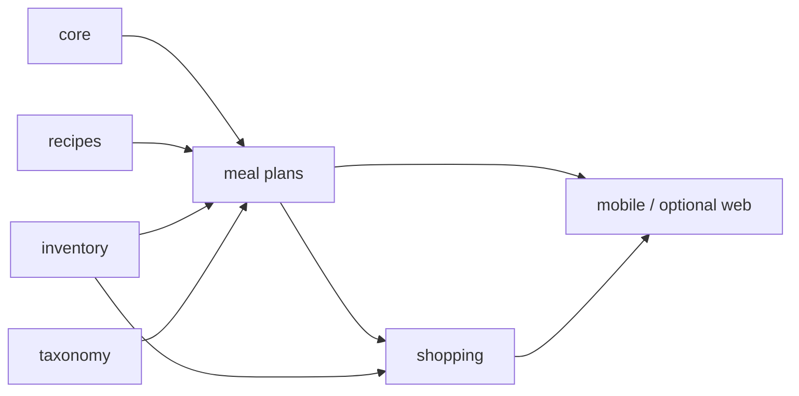

# RFC 008 — The Week Implementation

Status: Draft · August 2026
Relates to: `docs/prd/modules/meal-plans.md` v0.1 · `docs/prd/modules/shopping.md` v0.1 · `docs/prd/modules/household.md` v0.1 · `docs/prd/modules/inventory.md` v0.1 (§4, §6) · `docs/prd/modules/recipes.md` v0.1 · `docs/prd/modules/core.md` v0.1 (§6) · `docs/prd/modules/feedback.md` v0.1 (§4.4, §8) · `docs/prd/modules/admin.md` v0.1 · `docs/rfc/RFC001_Initial_Technical_Structure.md` · `docs/rfc/RFC002_Core_Module_Implementation.md` · `docs/rfc/RFC004_Inventory_Module_Implementation.md` · `docs/rfc/RFC005_Inventory_Mobile_UI.md` · `docs/rfc/RFC007_Recipes_Module_Implementation.md` · current scaffolds in `saamly-service`, `saamly-mobile`, `saamly-admin`, and optional `saamly-web`

This RFC specifies *how* P0c — *The week* — is implemented. The three module specs own product behaviour: planner-lite, the shared list, and household collaboration. This RFC owns package boundaries, the heuristic, the accepted-plan snapshot, atomic plan/list persistence, DynamoDB keys, API contracts, Flutter offline architecture, gate measurement, delivery slices and amendments to earlier RFCs. It does not introduce a second household backend.

## 1. Goals and non-goals

**Goals**

- Ship planner-lite: seven Monday-to-Sunday dinner slots, household recipes only, inventory-fit reasons, swap, regenerate and explicit accept.
- Snapshot accepted recipe requirements so `shopping` never reads recipes and recipe edits cannot silently change an active list.
- Ship one household-shared list: *Still needed*, *Check at home*, manual rows and idempotent *Bought* / *Already have* actions.
- Make plan acceptance and list reconciliation one atomic commit. A failed reconcile leaves the plan draft and the previous accepted plan/list visible.
- Upgrade inventory's `Availability` port to aggregate all shared rows per concept across locations and exclude personal rows.
- Add `HouseholdPreferences.ListActive` without copying preference data into plans.
- Complete D8 on Flutter for both local-first surfaces: inventory and shopping use drift + an ordered outbox.
- Measure the P0c gate in `feedback` / `admin`: two consecutive weeks accepted and shopped by the same household, plus the manual no-group-chat check.
- Keep `saamly-service` hexagonal: domain packages contain no HTTP, DynamoDB or AWS SDK types.

**Non-goals**

- LLM plan generation. P0c uses a deterministic heuristic and does not increment `CapabilityPlanGenerate`.
- Breakfast/lunch, servings adaptation, nutrition, fixed meals, pins, participation, voting, rotas, cooking completion or inventory deduction.
- Numeric quantity arithmetic or unit conversion.
- Retailer catalogs, prices, packs, baskets, comparison, subscriptions or cart handoff.
- Chat, comments, presence, push notifications, WebSockets or SSE.
- Personal plans or private shopping lists. Plans and lists are household-shared.
- A `/household/workspace` aggregate or new household persistence model.
- Background OS sync. P0c sync runs on app start, foreground and reconnect.
- `saamly-web` parity as a phase gate. An online-only web slice is optional.

## 2. Binding amendments to earlier RFCs

This RFC supersedes only the following technical seams:

1. **RFC 004 `Availability`.** Replace the single-item `States` projection with the aggregate coverage contract in §4. A `CONCEPT#` pointer may remain a dedup hint; it is not sufficient for planning or shopping.
2. **RFC 004 use-first timing.** `use_first` becomes a P0c planner signal. Mark-cooked deduction remains later.
3. **RFC 005 staleness.** Replace client-only `SAAMLY_STALE_DAYS=7` with the shared service policy `SAAMLY_INVENTORY_STALE_DAYS=14`; clients display the same default but server `Availability` owns classification.
4. **RFC 005 Slice E.** The drift/outbox contract becomes required P0c work and is implemented in §11.
5. **RFC 007 planner visibility.** A P0c shared plan includes `household` recipes only. Personal recipes remain owner-only until *Share with household*; RFC 007 §3.2's “member's plan” column does not apply because P0c has no personal plan.

All other RFC 002–007 decisions remain binding: `AuthFrom(ctx)`, 404 scoping, `PurgeHook`, best-effort events, idempotency, field-group LWW, provenance and `raw_text` passthrough.

## 3. Architecture and package layout

### 3.1 Dependency direction



The arrows show data dependency, not Go imports. `mealplans` consumes `RecipeLibrary`, `Availability`, `HouseholdPreferences` and a `ShoppingListReconciler` port. `shopping` consumes only an `AcceptedPlanSnapshot` DTO and `Availability`; it must not import `domain/recipe`, `application/recipes` or `RecipeLibrary`.

`household` is a client composition and collaboration contract. Core remains the only owner of household identity, membership, invites, preferences and deletion.

### 3.2 Service layout

```
saamly-service/
  internal/
    domain/
      plan/                       # REPLACE doc.go
        plan.go
        week.go
        scoring.go
        preferences.go
      shopping/                   # NEW
        shopping.go
        normalise.go
        reconcile.go
    application/
      profile/
        household_preferences.go  # NEW
      inventory/
        availability.go           # REPLACE single-item projection
        shopping_refresh.go       # NEW best-effort hook
      mealplans/                  # NEW
        service.go
        generate.go
        regenerate.go
        swap.go
        accept.go
        purge.go
      shopping/                   # NEW
        service.go
        reconcile.go
        refresh.go
        crud.go
        list.go
        purge.go
      feedback/
        metrics.go                # NEW gate calculations
    ports/
      availability.go             # REPLACE StateView
      preferences.go              # NEW HouseholdPreferences
      plan.go                     # NEW repositories + WeekCommitter
      shopping.go                 # NEW repository + reconcile/refresh ports
    adapters/
      memory/
        plan.go
        shopping.go
        store.go                   # EXTEND
      dynamodb/
        keys.go                    # EXTEND
        plan.go
        shopping.go
        week_commit.go             # atomic accept + list
      httpapi/
        mealplans.go
        shopping.go
        server.go                  # EXTEND
  cmd/
    api/main.go                    # EXTEND
    worker/main.go                 # EXTEND purge hooks
  api/
    consumer.yaml                  # EXTEND before handlers
    admin.yaml                     # EXTEND P0c metrics
  scripts/
    seed-week.sh                   # NEW
```

### 3.3 Client layout

```
saamly-mobile/lib/src/
  core/
    connectivity/
    storage/                       # drift database, DAOs, migrations
    sync/                          # outbox + coordinator + purge
  features/
    household/                     # app shell; no repository
    plan/
    shopping/
    recipes/                       # P0b read-only mobile catch-up
    inventory/                     # refactor controller onto drift/outbox

saamly-admin/src/
  routes/DashboardPage.tsx         # EXTEND P0c gate
  api/                             # EXTEND MetricsOverview

saamly-web/src/                    # OPTIONAL online parity
  routes/WeekPlanPage.tsx
  routes/ShoppingListPage.tsx
```

## 4. Shared prerequisites

### 4.1 Aggregated availability

Replace `ports.StateView` / `Availability.States` with:

```go
type Coverage string

const (
	CoverageCovered     Coverage = "covered"
	CoverageCheckAtHome Coverage = "check_at_home"
	CoverageNeeded      Coverage = "needed"
)

type CoverageView struct {
	Coverage        Coverage
	HasUseFirst     bool
	LastConfirmedAt time.Time
	EvidenceCount   int
}

type Availability interface {
	Coverage(ctx context.Context, householdID string, conceptIDs []string) (map[string]CoverageView, error)
}
```

Implementation loads the household's non-deleted inventory rows once, groups requested concept IDs in process, excludes `personal`, and applies:

1. `covered` when any non-stale `have` / `use_first` row has quantity `enough`.
2. Otherwise `check_at_home` when any present row is `probably_have`, has quantity `unknown`, or is stale.
3. Otherwise `needed` (only `out`, only `low`, or no shared row).
4. A present row outranks `out`; a fresh sufficient row outranks stale/low evidence elsewhere.
5. `HasUseFirst` is true only for non-stale use-first evidence.
6. `LastConfirmedAt` is the newest present shared evidence timestamp.

Staleness is computed here from `SAAMLY_INVENTORY_STALE_DAYS` (default 14). Consumers never recompute it.

At P0 scale, extend `ItemRepository.ListByHousehold` usage and aggregate one household query in memory. The implementation must exhaust every cursor page before classifying any concept; the repository's default 100-row page is not a completeness boundary. Do not create one concept GSI per location. Profile before adding an index.

### 4.2 Household preferences

Add:

```go
type MemberPreferences struct {
	UserID     string
	Dietary    []string
	Allergies  []string
	AvoidText  string
}

type HouseholdPreferences interface {
	ListActive(ctx context.Context, householdID string) ([]MemberPreferences, error)
}
```

`application/profile` implements it over `HouseholdRepository.ListMembers` and `PreferencesRepository.Get`. Current membership rows are active; invites are not. A missing preferences row yields defaults with empty constraints.

### 4.3 Inventory-to-shopping refresh

Add `ShoppingRefresher.RefreshAvailability(ctx, householdID, conceptIDs)`. After a successful inventory apply, state/quantity/ownership change, or remove, inventory calls this port best-effort for affected concepts. Failure does not roll back inventory; the next list open or reconnect self-heals.

Events remain records, not transport.

## 5. Domain model

### 5.1 `domain/plan`

| Type | Fields / rules |
|---|---|
| `Status` | `draft` · `accepted` · `archived` |
| `Plan` | `ID`, `HouseholdID`, `WeekStart`, `Status`, `Revision`, `Slots[]`, `Requirements[]`, `Generation`, `SwapCount`, `CreatedBy`, `UpdatedBy`, `AcceptedBy?`, timestamps and field-group timestamps |
| `PlanSlot` | `Date`, `RecipeID`, `RecipeUpdatedAt`, `RecipeTitleSnapshot`, `ReasonTags[]`, `Explanation?`, `ReviewFlags[]`, `UpdatedBy`, `UpdatedAt` |
| `RequirementSnapshot` | `CandidateKey`, `SlotDate`, `RecipeID`, `RawText`, `Quantity?`, `Unit?`, `Preparation?`, `ConceptID?`, `ConceptName?` |
| `GenerationContext` | `AlgorithmRevision` (`heuristic-v1`), `GenerationNumber` |
| `ReasonTag` | `use_first` · `covered` · `check_at_home` · `variety` |
| `ReviewFlag` | `preference_unknown` only at P0c |
| `AcceptedPlanSnapshot` | plan ID, household ID, week start, revision and immutable requirements; shopping's only plan input |

`WeekStart` and slot dates are ISO dates interpreted in `Africa/Johannesburg`. Week start must be Monday; slots must fall in the seven-day range.

Sentinels: `ErrPlanNotFound`, `ErrInvalidWeekStart`, `ErrNoHouseholdRecipes`, `ErrNoAlternative`, `ErrStalePlan`, `ErrStaleSlot`, `ErrStaleRevision`, `ErrConflict`, `ErrIdempotencyConflict`.

### 5.2 `domain/shopping`

| Type | Fields / rules |
|---|---|
| `ListStatus` | `active` · `archived` |
| `ItemSource` | `plan` · `manual` |
| `Section` | `still_needed` · `check_at_home` |
| `ItemState` | `open` · `bought` · `already_have` |
| `ShoppingList` | `ID`, `HouseholdID`, `PlanID?`, `PlanRevision?`, `WeekStart?`, `Status`, `Items` map, `Version`, attribution and timestamps |
| `ShoppingItem` | `ID`, `AggregationKey`, `RawTexts[]`, `DisplayText`, `ConceptID?`, `ConceptName?`, `QuantityLabels[]`, `MealCount`, `RequirementRefs[]`, source, section, check reason, state, attribution, per-field timestamps, `DeletedAt?`, `OmissionReason?` |
| `RequirementRef` | plan ID/revision, slot date, recipe ID, candidate key |

Plan aggregation keys are `concept:<id>` or `text:<normalised>`. The conservative text normaliser performs Unicode case-folding, trim, whitespace collapse and surrounding-punctuation removal only. It does not stem, singularise or fuzzy-match. The earliest slot-date/candidate-key line supplies display text.

Manual rows use `manual:<item_id>` and never auto-merge with plan rows. Manual edits do not attach taxonomy identity at P0c.

An open plan-derived row that becomes `covered` is retained in the server aggregate as a tombstone with `OmissionReason=covered` and is omitted from active API items. That tombstone reaches offline clients. If coverage later becomes needed/check-at-home, the same row is revived (clear `DeletedAt`/reason, update placement timestamp) and appears in the delta. Completed `bought` / `already_have` rows stay visible. `requirement_removed` and `user_removed` are the other omission reasons; covered tombstones with live requirement references are not compacted.

Sentinels: `ErrItemNotFound`, `ErrPlanItemImmutable`, `ErrInvalidState`, `ErrInvalidSection`, `ErrListTooLarge`, `ErrConflict`, `ErrIdempotencyConflict`.

## 6. Planner heuristic and preference handling

### 6.1 Eligible recipes

Load `RecipeLibrary.ListVisible`, then retain only:

- `visibility=household`;
- not deleted;
- no explicit household-preference conflict.

Empty title, ingredients or steps do not make a recipe ineligible. Personal recipes never enter a shared plan.

### 6.2 Preference checks

- Split `avoid_text` on comma/newline.
- Compare allergies / avoid phrases against ingredient `raw_text` and `concept_name` using `taxonomy.Normalise` and whole-token / whole-phrase equality.
- An explicit allergy or avoid match excludes the recipe.
- RFC 006 deliberately has no safety metadata today. Dietary values therefore set `preference_unknown`; they do not trigger invented exclusions.
- Any unresolved ingredient also sets `preference_unknown`.
- The warning never blocks acceptance and never labels a meal safe.

Adding verified allergen/dietary metadata is a future taxonomy amendment, not hidden RFC 008 scope.

### 6.3 Ranking

For each recipe, de-duplicate resolved concept IDs, then compute:

```
fit = (3 * use_first_concepts + 2 * covered_concepts + 0.5 * check_at_home_concepts)
      / max(1, resolved_concepts)
```

Sort by fit descending, then recipe ID ascending. The initial plan takes up to seven candidates in that order and assigns them Monday onward, so use-first evidence naturally appears earlier. Empty slots are allowed.

Reason tags and copy come only from the evidence counted above:

- `use_first` → *Uses the spinach first* (use the relevant concept name);
- `covered` → *Uses more of what you have*;
- `check_at_home` is a warning, not a sufficiency claim;
- no positive evidence → `variety` with no inventory claim.

`inventory_fit_slots` counts filled slots with a covered or non-stale use-first signal.

### 6.4 Regenerate and swap

- Swap selects the next recipe in the same stable ranked order, excluding recipes already in the proposal.
- Regenerate increments `GenerationNumber` and rotates candidates only within equal-score bands. It never promotes a lower-fit recipe over a higher-fit recipe and never randomises.
- If no different valid result exists, return `ErrNoAlternative` and leave the draft unchanged.
- Mutating an accepted plan first forks a new draft revision; accepted revisions are immutable.

## 7. Ports and use cases

### 7.1 Ports

| Port | Required operations |
|---|---|
| `PlanRepository` | `GetByID`, `GetCurrent(weekStart)`, `PutInitial`, `PutDraftRevision`, `ListRevisions`, idempotency reads |
| `ShoppingListRepository` | `GetActive`, `PutManual`, `UpdateManual`, `SetStatus`, `SoftDeleteItem`, `MarkOpenedOnce`, delta filtering, idempotency reads |
| `ShoppingListReconciler` | `ReconcileFromPlan(ctx, AcceptedPlanSnapshot) (ReconcileResult, error)` — reads active list + Availability and prepares the next aggregate but does not persist |
| `ShoppingRefresher` | `RefreshAvailability(ctx, householdID, conceptIDs) error` |
| `WeekCommitter` | `AcceptAndReconcile(ctx, AcceptBundle) error` — atomic plan/list adapter operation |
| `RecipeLibrary` | existing; mealplans only |
| `Availability` | §4.1 |
| `HouseholdPreferences` | §4.2 |

`ReconcileResult` contains the full next active list plus event counts/type. `AcceptBundle` contains the expected plan revision, previous accepted revision, prepared list, expected list version and idempotency result.

### 7.2 Meal-plan use cases

| Use case | Behaviour | Event |
|---|---|---|
| `GetCurrent` | Return current draft/accepted revision; no row returns `plan:null` | — |
| `Generate` | Validate week; return existing current revision unchanged; otherwise rank and persist first draft | `meal_plans.plan_generated` only when created |
| `Regenerate` | Fork accepted if needed; rotate equal-score candidate bands; persist next draft revision | `meal_plans.plan_regenerated` |
| `Swap` | Fork accepted if needed; replace one slot with next eligible candidate | `meal_plans.meal_swapped` |
| `Accept` | Validate recipe versions; snapshot requirements; prepare list; commit both; idempotent same-revision retry | `meal_plans.plan_accepted` plus one shopping generated/reconciled event |

Accept validates every `RecipeUpdatedAt`. Missing or changed recipes return `ErrStalePlan` with affected dates. A second accept of the same revision returns the committed result. If another revision won, return `ErrStaleRevision`.

`SwapCount` counts successful swaps in that draft revision.

### 7.3 Shopping use cases

| Use case | Behaviour | Event |
|---|---|---|
| `ReconcileFromPlan` | Aggregate snapshot; map Availability; preserve matching statuses/manual rows; persistence remains in WeekCommitter | emitted after commit |
| `RefreshAvailability` | Reclassify matching plan rows only; preserve status/manual rows | `shopping.list_reconciled` when changed |
| `GetList` | Full or item delta; no list returns null + empty items | — |
| `RecordOpened` | Attempt full availability self-heal for plan rows, then record replay-safe usage; refresh/event failures are logged and never block opening | `shopping.list_reconciled{trigger:list_opened}` if changed, then `shopping.list_opened` |
| `AddManual` | Lazy-create list; server ID returned and mapped to local temp ID | `shopping.item_added` |
| `UpdateManual` | Content field-group LWW; reject plan-row content edit | — |
| `SetStatus` | Idempotent set state; `open` on check-at-home means *Need it* and moves to still-needed | `shopping.item_status_changed` |
| `Remove` | Tombstone | `shopping.item_removed` |

First/new-week reconcile emits `shopping.list_generated`; same-week re-accept or availability movement emits `shopping.list_reconciled`, never both.

## 8. DynamoDB design and atomicity

### 8.1 Keys

All rows remain in `saamly-{env}` under `PK=HOUSE#<household_id>`.

| Entity | SK | Notes |
|---|---|---|
| Week pointer | `PLANWEEK#<yyyy-mm-dd>` | plan ID for the week |
| Plan metadata | `PLAN#<plan_id>` | week start, current revision, accepted revision |
| Plan revision | `PLAN#<plan_id>#REV#<zero-padded revision>` | embedded slots + requirement snapshot |
| Active shopping aggregate | `SHOP#ACTIVE` | embedded item map + per-item timestamps + list version |
| Archived shopping aggregate | `SHOP#ARCH#<week_start>#<list_id>` | immutable prior-week snapshot |
| List-open marker | `SHOPOPEN#<list_id>#<user_id>#<yyyy-mm-dd>` | conditional create; enforces at most one opened event per user/list/local-date |
| Idempotency | existing `IDEM#<key>/META` | 24h TTL |

No new GSI is needed at P0c. Current-plan lookup is `PLANWEEK` → metadata → revision. Mutations by plan ID read metadata directly. Revision history is a partition-prefix query.

### 8.2 Why the shopping list is one aggregate row

Embedding P0c shopping items keeps accept + reconcile within a small transaction, while each item still carries independent field-group timestamps. `GET ?updated_since=` reads the row and filters changed items/tombstones in process. A covered transition updates the row's placement timestamp and returns a tombstone; revival returns the full row under the same ID. At dogfood scale this is simpler and safer than a transaction containing one write per ingredient.

Guardrails:

- maximum 200 active/tombstoned item records;
- adapter refuses serialised rows above 350 KB with `ErrListTooLarge` — never truncate;
- removed-requirement/user tombstones older than `SAAMLY_SHOPPING_TOMBSTONE_DAYS` are compacted on writes; covered rows with live requirement references are retained for revival;
- if dogfood approaches either limit, split child rows in an RFC amendment before wider rollout.

### 8.3 Transactions

**Generate** (`TransactWriteItems`):

1. conditionally create week pointer;
2. create plan metadata;
3. create revision 1;
4. write idempotency result.

**Swap/regenerate/fork:**

1. condition on expected current revision / slot timestamp;
2. put the new draft revision;
3. update plan metadata current revision;
4. write idempotency result.

**Accept + reconcile:**

1. conditionally update draft revision to accepted and attach requirements;
2. archive the previously accepted revision when present;
3. update plan metadata accepted/current revision;
4. put the next active shopping aggregate with a condition on its expected `Version`;
5. on week rollover, put the previous list archive;
6. write idempotency result.

The use case pre-reads recipes and the active list, prepares deterministic outputs, then calls `WeekCommitter`. A concurrent list mutation changes `Version`; the use case reloads and retries preparation up to three times. No plan status changes before the transaction succeeds.

Manual list item writes use nested map paths and conditions on that item's field-group timestamp. They increment list `Version` atomically. Two writes to different items can both succeed; idempotent same-state writes return the current item.

Events append after commit and remain best-effort.

## 9. Consumer API

Contract changes land in `saamly-service/api/consumer.yaml` before handlers. Spectral remains at zero errors.

### 9.1 Meal plans

| Method | Path | Request / response |
|---|---|---|
| GET | `/v1/meal-plans/current?week_start=YYYY-MM-DD` | `{ "plan": Plan \| null }` |
| POST | `/v1/meal-plans/generate` | body `{week_start}` + `Idempotency-Key` → `{plan}` |
| POST | `/v1/meal-plans/{id}/regenerate` | expected status timestamp + idem → `{plan}` |
| POST | `/v1/meal-plans/{id}/slots/{date}/swap` | expected slot timestamp + idem → `{plan}` |
| POST | `/v1/meal-plans/{id}/accept` | expected status timestamp + idem → `{plan, shopping_list_summary}` |

Generation accepts only the current or immediately following Monday in `Africa/Johannesburg`. Reads require a valid Monday. All timestamps are RFC 3339; dates are `YYYY-MM-DD`.

### 9.2 Shopping

| Method | Path | Request / response |
|---|---|---|
| GET | `/v1/shopping-list?updated_since=` | `{list, items, tombstones}`; before creation `{list:null,items:[],tombstones:[]}` |
| POST | `/v1/shopping-list/opened` | `{occurred_at, online}` + idem → `204`; replayable from mobile outbox |
| POST | `/v1/shopping-list/items` | `{raw_text}` + idem → `{item}` |
| PUT | `/v1/shopping-list/items/{id}` | manual display text + expected content timestamp + `Idempotency-Key` → `{item}` |
| POST | `/v1/shopping-list/items/{id}/status` | `{state, expected_status_updated_at}` + idem → `{item}` |
| DELETE | `/v1/shopping-list/items/{id}` | idem → `204` |

`RecordOpened` emits at most once per user/list/local-date. `MarkOpenedOnce` conditionally creates the `SHOPOPEN` marker before appending the event; an existing marker returns 204 without another append. Markers have no TTL at P0c, are removed by shopping's household purge, and make both outbox replay and a second legitimate open that day safe. If the best-effort event append fails after the marker succeeds, log/measure the append failure and do not fail the user action.

Shopping item events include `list_id` and `week_start?`; item interaction can therefore satisfy the gate for a plan-backed list without joining mutable application rows.

### 9.3 Existing recipe contract used by mobile

Slice 0 vendors RFC 007's existing recipe paths into `saamly-mobile/vendor/api/consumer.yaml`, including at minimum `GET /v1/recipes` and `GET /v1/recipes/{id}` for the required Recipes tab. RFC 008 does not redefine those schemas or service handlers.

### 9.4 Error mapping

| Condition | HTTP / problem title |
|---|---|
| Missing/cross-household plan or item | `404 not_found` |
| Stale recipe or competing accepted revision | `409 stale_plan` with affected dates/current revision |
| Slot/content field-group conflict | `409 conflict` with field group + server timestamp |
| No swap/regenerate candidate | `409 no_alternative`; unchanged plan |
| Concurrent list change after retry budget | `409 conflict`; accepted plan remains unchanged |
| Invalid week/date/state | `422 invalid_request` |
| No household recipes | `422 no_recipes` with add-recipe hint |
| Aggregate exceeds safe size | `422 list_too_large`; log/alert, never truncate |

Status set to its existing value returns 200. Cross-household existence is never leaked with 403.

## 10. Composition, purge and configuration

### 10.1 Composition

`cmd/api` and `cmd/worker`:

1. Build item, recipe, plan and shopping repositories.
2. Build inventory with aggregate Availability and a nil-safe `ShoppingRefresher`.
3. Build shopping with its repository, Availability, events, clock and IDs.
4. Assign shopping as inventory's refresher after both services exist.
5. Build profile `HouseholdPreferences`.
6. Build mealplans with RecipeLibrary, Availability, HouseholdPreferences, ShoppingListReconciler and WeekCommitter.
7. Register meal-plan and shopping handlers in `httpapi.Deps`.
8. Register plan and shopping purge hooks beside capture, inventory, taxonomy and recipes.

No new worker loop and no LLM adapter are required.

### 10.2 Purge

Plan purge deletes `PLANWEEK#*` and `PLAN#*`. Shopping purge deletes `SHOP#*` and `SHOPOPEN#*`. Both are hard deletes under the existing household purge registry. Member removal does not delete shared plans/lists; clients clear local household data when auth confirms loss of membership.

### 10.3 Configuration

| Env | Default | Rule |
|---|---|---|
| `SAAMLY_INVENTORY_STALE_DAYS` | `14` | integer ≥ 1 |
| `SAAMLY_SHOPPING_TOMBSTONE_DAYS` | `30` | integer ≥ 1 |
| `SAAMLY_SHOPPING_LIST_LIMIT` | `200` | 1–200 |

`Africa/Johannesburg` and `heuristic-v1` are code constants in P0c so a deploy cannot silently change week semantics or ranking without a tested revision change.

## 11. Flutter implementation

The phase gate is exercised on two Flutter phones. Inventory and shopping must be local-first; plans are online-first.

### 11.1 Dependencies and shared storage

Add the latest compatible `drift`, SQLite Flutter integration, `drift_dev`, `build_runner` and connectivity packages through Flutter's package manager. Do not pin versions in this RFC.

Drift tables:

| Table | Purpose |
|---|---|
| `inventory_items` | local mirror including tombstones/field timestamps |
| `shopping_lists` | active list metadata |
| `shopping_items` | local item mirror |
| `plan_cache` | last fetched current/next plan; read-only offline |
| `sync_cursors` | per household/domain `updated_since` |
| `outbox_entries` | ordered mutations with method, path, body, idempotency key, local entity ID, attempts and error |

The outbox is an ordered log. Reads come from drift after first hydration. Inventory/shopping mutations write local state and enqueue before returning to UI.

Lifecycle:

```
app start / foreground / reconnect
  -> drain outbox in sequence
  -> for each domain whose outbox is empty, pull its delta
  -> refresh online plan
```

If a transient failure leaves pending inventory or shopping entries, do not pull or advance that domain's cursor. This prevents a server delta from overwriting optimistic local fields. Definitive 409/404 responses resolve the entry against the server first; only then may that domain pull. One blocked domain does not block another.

No `workmanager` in P0c. Connectivity hints trigger attempts; HTTP success/failure remains authoritative. Mobile CI runs drift code generation after `flutter pub get` and before format/analyze/test; generated schema drift fails the build.

### 11.2 Conflict rules

| Surface | Conflict |
|---|---|
| Inventory field groups | server wins; patch drift silently |
| Shopping status | idempotent set-state; newest server timestamp wins silently |
| Shopping manual content | show conflict and refreshed text |
| Plan slot/status | refresh and show *This week changed while you were editing. Review it before saving.* |

Offline manual creates use a local UUID. On successful replay, the outbox processor transactionally remaps the local row to the server ID and updates later queued entries that reference it.

On confirmed household removal / sign-out, clear inventory, recipes cache, plan cache, shopping, cursors and outbox entries for that household before routing away.

### 11.3 Workspace and routes

Replace `/home` with a shell while preserving an inventory redirect:

```
/app/week       This week
/app/inventory  What you have
/app/list       Your shared list
/app/recipes    Recipes
```

The shell composes current household members for names/initials. It has no repository of its own.

Required feature files:

```
features/household/  app_shell, offline banner, member attribution
features/plan/       models, API repository, controller, screen, slot cards, conflict UI
features/shopping/   models, API repository, drift store, controller, sections, item rows
features/recipes/    visible recipe summary list (P0b mobile catch-up)
```

The Recipes tab must be real and list household-visible recipes. Full mobile recipe edit/import parity remains RFC 007 follow-on work and does not block P0c service implementation; the planner empty state links to the available add-recipe path.

### 11.4 Offline matrix

| Surface | Offline read | Offline write |
|---|---|---|
| Inventory | yes | yes, outbox |
| Shopping | yes | yes, outbox |
| Plan | last cached plan | no; retain form intent and retry online |
| Recipes | cached summaries if present | no |
| Scan/import | existing online contract | no new RFC 008 behaviour |

When a persisted list is opened offline, enqueue `POST /shopping-list/opened` with the original `occurred_at` and `online=false`; this is required for an honest gate metric.

## 12. Feedback and admin measurement

### 12.1 Event payloads

Emit the exact catalogued events from `feedback.md`. Add `week_start?` to `shopping.item_added`, `shopping.item_status_changed` and `shopping.item_removed`; it is present for plan-backed lists and absent for a pre-plan manual list.

No event contains recipe titles, ingredient/list text, allergies or household member names.

### 12.2 Gate formula

For each household:

1. `accepted_weeks` = distinct Monday `week_start` values in `meal_plans.plan_accepted`.
2. A week is `shopped` when the same household/week has `shopping.list_opened` or any shopping item interaction.
3. Sort accepted+shopped weeks and find the longest run where adjacent starts differ by seven days.
4. P0c quantitative target is run length ≥ 2.
5. Show distinct list users per week as supporting evidence; both dogfood members should use the surface.
6. Record the no-group-chat check manually in the weekly gate ritual; telemetry cannot infer it.

Implement this in `internal/application/feedback/metrics.go`, not directly in an HTTP handler. Extend `api/admin.yaml`, the admin metrics handler and `saamly-admin` dashboard with:

- *Weeks planned in a row* (current / target 2);
- accepted weeks and shopping-qualified weeks;
- distinct plan/list participants;
- recipes used in accepted plans;
- swap burden.

The raw event endpoint remains the drill-down. An admin Events page is recommended but not a P0c exit blocker.

## 13. Delivery slices

Each slice keeps its repository green. Mobile foundation can run in parallel with service slices.

| Slice | Delivers | Demo |
|---|---|---|
| **0 — Contracts and prerequisites** | Availability v2; stale config; HouseholdPreferences; consumer/admin OpenAPI schemas; key builders; feedback payload update; vendor existing RFC 007 recipe reads into mobile | coverage tests; `GET current` / `GET list` stubs return null, not 501 |
| **A — Domain + memory adapters** | plan/shopping domains, heuristic, normalisers, repositories, reconcile pure logic | two recipes produce a seven-slot/empty proposal; snapshot maps to list |
| **B — Meal-plan use cases** | generate, regenerate, swap, fork, stale checks, events | generate → swap → regenerate in memory |
| **C — Shopping use cases** | manual CRUD, status, list-opened, refresh, events; import-boundary test | manual list + coverage section changes |
| **D — Atomic commit + DynamoDB** | embedded list aggregate; WeekCommitter; transactions; retries; integration tests | failed reconcile leaves draft; retry accepts and persists after restart |
| **E — HTTP, composition and purge** | handlers, problem mapping, api/worker wiring, purge hooks, `seed-week.sh` | curl generate → accept → list; household purge removes all |
| **F — Feedback/admin** | gate calculator, admin schema/handler/dashboard/tests | dashboard shows 0/2 then 2/2 from fixture events |
| **G — Flutter offline foundation** | drift, outbox, cursors, connectivity; refactor inventory local-first | offline inventory write → reconnect |
| **H — Flutter workspace + shopping** | app shell, recipes summary tab, local-first shared list, opened telemetry | airplane-mode bought → reconnect → second phone sees it |
| **I — Flutter plan + collaboration** | week UI, swap/regenerate/accept, polling/conflicts, list refresh | two phones accept plan and use resulting list |
| **W — Optional web parity** | online week/list routes, hooks, MSW/Vitest | browser generate → accept → list |

**P0c service software exit:** all API paths real; plan/list commit atomic; shopping has no recipe import; Availability aggregates; purge cascades; gate events emitted; `go test ./...`, vet and Spectral green.

**P0c phase exit:** two Flutter phones plan and shop for two consecutive weeks; both members use the list; no lost offline actions; weekly check confirms no group-chat fallback.

## 14. Testing strategy

| Layer | Required cases |
|---|---|
| Availability | multi-location precedence; personal exclusion; stale evidence; use-first; no match; >100 rows prove every cursor page is consumed |
| Preferences | current members only; missing prefs; token/phrase match; dietary/unresolved warning |
| Plan domain | Johannesburg Monday validation; slot dates; stable scoring; reason tags; empty slots |
| Plan use cases | household-only recipes; idempotent generate; accepted fork; no alternative; stale recipe; concurrent accept |
| Shopping domain | concept/text grouping; manual isolation; deterministic display; coverage mapping |
| Reconcile | preserve bought/have/manual rows; week rollover; needed → covered tombstone → needed revival delta; open-time self-heal; aggregate size guard |
| Atomic adapter | condition failure leaves old plan/list; list-version retry; idempotent accept; restart persistence |
| Inventory hook | refresh failure does not fail inventory; next reconcile self-heals |
| HTTP | problem+json, auth scoping, expected timestamps, idempotency (including PUT replay), explicit opened endpoint and two different same-day keys still emit one opened event |
| Purge | plans, revisions, list aggregates and list-open markers removed; global idempotency rows expire on their existing 24h TTL |
| Import boundary | CI fails if `application/shopping` imports recipe packages/ports |
| Feedback | longest consecutive run; duplicate accepts; opened/item interactions; household isolation |
| Flutter sync | outbox order; local-ID remap; no delta/cursor advance while domain entries remain; covered tombstone/revival; status merge; household purge |
| Flutter widgets | four tabs; plan empty/generate/swap/accept; list sections; offline banner; conflict copy |
| Physical devices | two-phone offline shop and same-slot plan conflict |

Floci integration tests use `//go:build integration`. Flutter database tests use an in-memory drift executor; one integration test runs outbox → fake HTTP → delta convergence.

## 15. Optional `saamly-web` parity

If capacity remains after required mobile/admin work:

- add `/week` and `/list`;
- add plan/shopping types, clients and TanStack Query hooks;
- extend AppShell navigation;
- add MSW state and tests for generate → swap → accept → list, stale slot conflict and manual-row preservation.

Web stays online-only. It does not get IndexedDB/outbox work and does not satisfy the two-phone P0c gate.

## 16. Risks and locked decisions

| Risk | Decision / mitigation |
|---|---|
| Shopping accidentally reads mutable recipes | accepted snapshot DTO only + import-boundary test |
| Accept leaves a plan without its list | one `WeekCommitter` transaction; plan stays draft on failure |
| Ingredient fan-out exceeds transaction limit | embedded list aggregate; 350 KB / 200-row guard |
| Embedded list becomes a hot row | two-member P0 volume; per-item nested updates; split only with measured need |
| Single concept pointer hides another location | one household inventory query + in-process aggregation |
| Personal data leaks into shared output | Availability excludes personal; planner filters household recipes |
| Preferences imply false safety | explicit text conflicts only; unknown warning; no “safe” label |
| Ranking becomes an optimisation project | fixed `heuristic-v1`; no model, budget or portfolio solver |
| Offline use is missing from gate data | explicit replayable list-opened endpoint with original timestamp |
| Client/server stale ages differ | server owns 14-day coverage; mobile display default aligned |
| Polling feels stale | foreground/reconnect refresh + low-frequency visible polling; no push without evidence |
| Existing RFCs contradict P0c | §2 is the explicit amendment list |

**Locked by this RFC unless amended:**

1. One RFC covers the P0c service, required Flutter work and gate measurement.
2. Monday weeks use `Africa/Johannesburg`.
3. Planner is deterministic `heuristic-v1`; no LLM.
4. Shared plans use household recipes only.
5. Shopping list is an embedded DynamoDB aggregate at P0c.
6. Plan accept + list reconcile is atomic.
7. Inventory and shopping are local-first on Flutter; plan is online-first.
8. Web parity is optional.

## 17. Out of scope reminders

Do not add to RFC 008 slices:

- AI plan prompts or conversational planning.
- precise shopping totals or unit conversion.
- retailer catalog/SKU/price work.
- recipe adaptation or substitutions.
- participation, pins, fixed meals, voting, assignments or rotas.
- cooking mode, mark-cooked or inventory deduction.
- real-time transports or push notifications.
- public sharing/community.
- background OS sync.
- web offline storage.

## 18. Implementation checklist

When this RFC is accepted:

1. Land Slice 0 OpenAPI and prerequisite contracts first; no handlers before schemas.
2. Implement service A–F and Flutter G–I; G may run in parallel with A–F.
3. Vendor the tagged `consumer.yaml` into mobile before plan/list repositories.
4. Add the shopping-to-recipe import-boundary check to CI.
5. Align mobile stale display from 7 to 14 days.
6. Add drift code generation to mobile CI, then run service unit/vet/Spectral, Floci integration, Flutter format/analyze/test/build, and two-device offline smoke tests.
7. Start the two-week gate only after dashboard calculation and list-opened offline replay are verified.
8. Record the qualitative group-chat fallback result in each weekly gate review.
